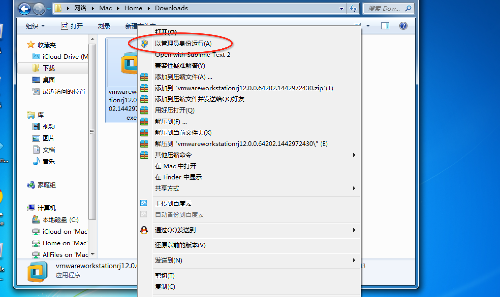
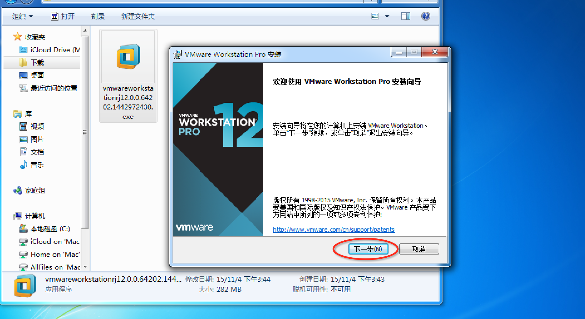
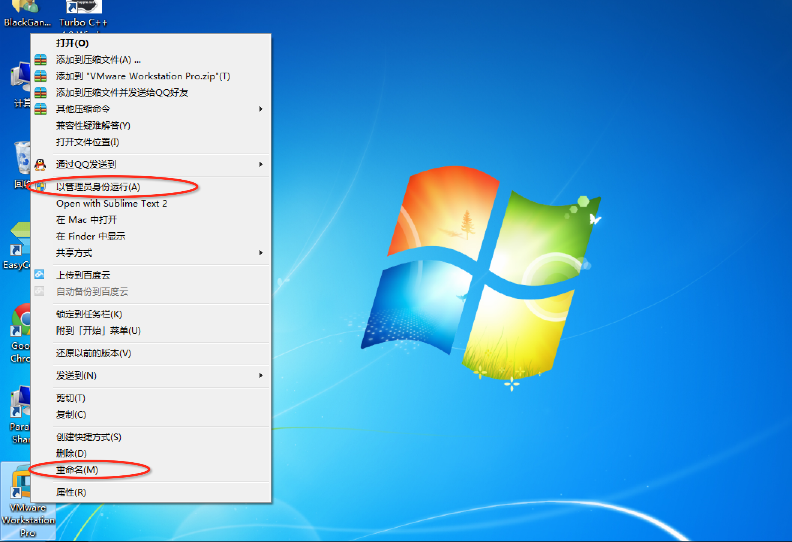
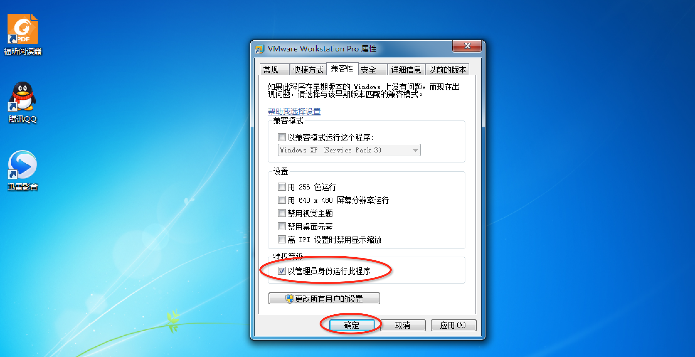

# HDU-Accounting-System-Install
杭电会计课程系统简化安装说明

## 1. 下载虚拟机文件

* 下载地址：[http://pan.baidu.com/s/1hqIwuMg](http://pan.baidu.com/s/1hqIwuMg)  密码：a1up

* 本虚拟机中包含有：**(用友系统，套账、使用说明等安装光盘所有内容以及相关组件)**。

* 下载说明: 我将其放置在百度云上，是一个完整的虚拟机文件，下载解压后可直接打开使用，因此比较大，压缩后仍有**10G左右**，可能需要安装百度云管家，
下载速度可能也比较慢, 如果有身边同学下载好，建议相互拷贝一下。

* 下载到你的电脑中，解压，记住**存放位置**。

## 2. 安装虚拟机 VMware

* 百度搜索**"vmware"**，下载该虚拟机软件。

* 打开安装程序，注意要选择**以管理员身份安装**(不然可能报错, 无法写入C盘)。

* 点击"下一步"安装，与一般安装软件基本相同，不想安装在C盘记得更改安装路径，几个选项可以勾选也可以不勾，不会对安装和使用造成影响。

* 安装到最后需要输入许可码，基本百度都可以免费搜到，不输入只有试用期60天，这里提供一个许可证：**5A02H-AU243-TZJ49-GTC7K-3C61N** (2015.11.04 亲测有效)。

* 安装完成！

## 3. 打开与配置虚拟机

* 打开虚拟机软件，也需**要以管理员运行**，或点击属性配置一下，这样不需要每次都右键。

* 进入VMware界面，点击**"打开虚拟机"**，你存放你的虚拟机文件目录下，打开.vmx文件, 如下图所示：

* 调整一下虚拟机内存到1G，然后打开虚拟机，完成！

## 帮助

如果有什么问题，可以邮件联系我: blackganglion@blackganglion.com
